# Python Learning Roadmap - Visual Navigation Guide

This is your complete visual guide to mastering Python. Use the interactive flowchart below to navigate your learning journey based on your goals and current skill level.

## Interactive Visual Roadmap

```mermaid
graph TD
    Start([🚀 Start Your Python Journey]) --> Assess{What's Your Background?}
    
    Assess -->|Complete Beginner| Basics[📚 Python Fundamentals<br/>Variables, Functions, Classes<br/>⏱️ 4-8 weeks]
    Assess -->|Some Programming| Basics
    Assess -->|Experienced Developer| QuickStart[⚡ Python Quick Start<br/>Syntax & Idioms<br/>⏱️ 1-2 weeks]
    
    QuickStart --> ChoosePath
    Basics --> ChoosePath{🎯 Choose Your Specialization}
    
    ChoosePath -->|Build AI/ML Systems| AIML[🤖 AI/ML Path]
    ChoosePath -->|Create Web Applications| WebDev[🌐 Web Backend Path]
    ChoosePath -->|Automate Everything| Automation[⚡ Automation & Scripting]
    ChoosePath -->|Manage Infrastructure| DevOps[🔧 DevOps Path]
    ChoosePath -->|Analyze Data| Analytics[📊 Data Analytics]
    ChoosePath -->|Secure Systems| Security[🔒 Cybersecurity]
    ChoosePath -->|Build Products Fast| Startup[🚀 Startup MVP]
    
    %% AI/ML Branch
    AIML --> AIMLPhase1[Phase 1: Data Foundations<br/>NumPy, Pandas, Matplotlib<br/>⏱️ 3-4 weeks]
    AIMLPhase1 --> AIMLPhase2[Phase 2: Machine Learning<br/>Scikit-learn, Model Training<br/>⏱️ 4-6 weeks]
    AIMLPhase2 --> AIMLPhase3[Phase 3: Deep Learning<br/>PyTorch, Neural Networks<br/>⏱️ 6-8 weeks]
    AIMLPhase3 --> AIMLProjects[🎯 AI/ML Projects<br/>Recommendation Systems<br/>Predictive Models<br/>Computer Vision]
    AIMLProjects --> AIMLAdvanced{Advanced AI/ML?}
    AIMLAdvanced -->|Deep Learning Focus| AIMLDeep[🧠 Deep Learning Specialist<br/>Neural Networks, Computer Vision, NLP]
    AIMLAdvanced -->|Production Focus| AIMLOps[🔧 MLOps Engineer<br/>Model Deployment, Monitoring, Scaling]
    
    %% Web Development Branch
    WebDev --> WebPhase1[Phase 1: Web Basics<br/>Flask, HTTP, APIs<br/>⏱️ 2-3 weeks]
    WebPhase1 --> WebPhase2[Phase 2: Full Framework<br/>Django, Databases, Auth<br/>⏱️ 4-6 weeks]
    WebPhase2 --> WebPhase3[Phase 3: Production<br/>Deployment, Scaling, Security<br/>⏱️ 4-6 weeks]
    WebPhase3 --> WebProjects[🎯 Web Projects<br/>E-commerce Platform<br/>Social Media API<br/>SaaS Application]
    WebProjects --> WebAdvanced{Advanced Web?}
    WebAdvanced -->|Architecture Focus| WebArch[🌐 API Architect<br/>Microservices, GraphQL, System Design]
    WebAdvanced -->|Full-Stack Focus| WebFull[🎯 Full-Stack Developer<br/>Frontend Integration, DevOps, Product]
    
    %% Automation Branch
    Automation --> AutoPhase1[Phase 1: Scripting Basics<br/>File Operations, CLI Tools<br/>⏱️ 2-3 weeks]
    AutoPhase1 --> AutoPhase2[Phase 2: Web Scraping<br/>Requests, BeautifulSoup, Selenium<br/>⏱️ 3-4 weeks]
    AutoPhase2 --> AutoPhase3[Phase 3: System Automation<br/>Scheduling, Monitoring, APIs<br/>⏱️ 3-4 weeks]
    AutoPhase3 --> AutoProjects[🎯 Automation Projects<br/>Price Monitor<br/>Social Media Bot<br/>Report Generator]
    AutoProjects --> AutoAdvanced{Advanced Automation?}
    AutoAdvanced -->|Enterprise Focus| AutoRPA[🤖 RPA Developer<br/>Enterprise Automation, Process Mining]
    AutoAdvanced -->|Integration Focus| AutoInt[🔗 Integration Specialist<br/>API Integration, Data Pipelines]
    
    %% DevOps Branch
    DevOps --> DevOpsPhase1[Phase 1: Infrastructure Basics<br/>AWS SDK, Docker, Linux<br/>⏱️ 3-4 weeks]
    DevOpsPhase1 --> DevOpsPhase2[Phase 2: Configuration Management<br/>Ansible, Terraform, CI/CD<br/>⏱️ 4-6 weeks]
    DevOpsPhase2 --> DevOpsPhase3[Phase 3: Orchestration<br/>Kubernetes, Monitoring, Scaling<br/>⏱️ 6-8 weeks]
    DevOpsPhase3 --> DevOpsProjects[🎯 DevOps Projects<br/>Auto-scaling Infrastructure<br/>Monitoring Dashboard<br/>Deployment Pipeline]
    DevOpsProjects --> DevOpsAdvanced{Advanced DevOps?}
    DevOpsAdvanced -->|Cloud Focus| DevOpsCloud[☁️ Cloud Architect<br/>AWS/Azure/GCP, Serverless, Infrastructure Design]
    DevOpsAdvanced -->|Platform Focus| DevOpsPlatform[🛠️ Platform Engineer<br/>Developer Tools, Internal Platforms, CI/CD]
    
    %% Data Analytics Branch
    Analytics --> AnalyticsPhase1[Phase 1: Data Manipulation<br/>Pandas, NumPy, SQL<br/>⏱️ 3-4 weeks]
    AnalyticsPhase1 --> AnalyticsPhase2[Phase 2: Visualization<br/>Matplotlib, Seaborn, Plotly<br/>⏱️ 2-3 weeks]
    AnalyticsPhase2 --> AnalyticsPhase3[Phase 3: Business Intelligence<br/>Dashboards, Reports, Insights<br/>⏱️ 4-5 weeks]
    AnalyticsPhase3 --> AnalyticsProjects[🎯 Analytics Projects<br/>Sales Dashboard<br/>Customer Segmentation<br/>Financial Analysis]
    AnalyticsProjects --> AnalyticsAdvanced{Advanced Analytics?}
    AnalyticsAdvanced -->|BI Focus| AnalyticsBI[📊 BI Specialist<br/>Dashboards, Reporting, Business Insights]
    AnalyticsAdvanced -->|Engineering Focus| AnalyticsEng[🏗️ Data Engineer<br/>Data Pipelines, ETL/ELT, Data Warehousing]
    
    %% Security Branch
    Security --> SecurityPhase1[Phase 1: Security Basics<br/>Networking, Cryptography<br/>⏱️ 3-4 weeks]
    SecurityPhase1 --> SecurityPhase2[Phase 2: Defensive Tools<br/>Log Analysis, Monitoring<br/>⏱️ 4-5 weeks]
    SecurityPhase2 --> SecurityPhase3[Phase 3: Advanced Security<br/>Threat Detection, Incident Response<br/>⏱️ 5-6 weeks]
    SecurityPhase3 --> SecurityProjects[🎯 Security Projects<br/>Network Scanner<br/>Log Analyzer<br/>Vulnerability Assessment]
    SecurityProjects --> SecurityAdvanced{Advanced Security?}
    SecurityAdvanced -->|Automation Focus| SecurityAuto[🔒 Security Automation<br/>SIEM/SOAR, Threat Detection, Incident Response]
    SecurityAdvanced -->|Testing Focus| SecurityPen[🎯 Penetration Testing<br/>Ethical Hacking, Vulnerability Assessment]
    
    %% Startup Branch
    Startup --> StartupPhase1[Phase 1: MVP Framework<br/>Flask, SQLite, Basic Auth<br/>⏱️ 2-3 weeks]
    StartupPhase1 --> StartupPhase2[Phase 2: Integrations<br/>Payments, Email, Analytics<br/>⏱️ 3-4 weeks]
    StartupPhase2 --> StartupPhase3[Phase 3: Growth Tools<br/>A/B Testing, Metrics, Scaling<br/>⏱️ 4-5 weeks]
    StartupPhase3 --> StartupProjects[🎯 Startup Projects<br/>SaaS MVP<br/>Marketplace Platform<br/>Mobile Backend]
    StartupProjects --> StartupAdvanced{Advanced Startup?}
    StartupAdvanced -->|Leadership Focus| StartupFounder[🚀 Tech Co-founder<br/>MVP Development, Team Leadership, Product Scaling]
    StartupAdvanced -->|Growth Focus| StartupGrowth[📈 Growth Engineer<br/>A/B Testing, Analytics, Growth Hacking]
    
    %% Advanced Convergence
    AIMLDeep --> Expert[🏆 Python Expert<br/>Contribute to Open Source<br/>Mentor Others<br/>Build Complex Systems]
    AIMLOps --> Expert
    WebArch --> Expert
    WebFull --> Expert
    AutoRPA --> Expert
    AutoInt --> Expert
    DevOpsCloud --> Expert
    DevOpsPlatform --> Expert
    AnalyticsBI --> Expert
    AnalyticsEng --> Expert
    SecurityAuto --> Expert
    SecurityPen --> Expert
    StartupFounder --> Expert
    StartupGrowth --> Expert
    
    %% Cross-Path Opportunities
    Expert --> CrossPath{Expand to Other Domains?}
    CrossPath -->|Yes| ChoosePath
    CrossPath -->|No| Mastery[🎓 Domain Mastery<br/>Thought Leadership<br/>Industry Recognition<br/>Technical Innovation]
    
    %% Styling
    classDef startNode fill:#4CAF50,stroke:#2E7D32,stroke-width:3px,color:#fff
    classDef pathNode fill:#2196F3,stroke:#1565C0,stroke-width:2px,color:#fff
    classDef phaseNode fill:#FF9800,stroke:#E65100,stroke-width:2px,color:#fff
    classDef projectNode fill:#9C27B0,stroke:#6A1B9A,stroke-width:2px,color:#fff
    classDef advancedNode fill:#F44336,stroke:#C62828,stroke-width:2px,color:#fff
    classDef decisionNode fill:#607D8B,stroke:#37474F,stroke-width:2px,color:#fff
    classDef expertNode fill:#795548,stroke:#5D4037,stroke-width:3px,color:#fff
    
    class Start startNode
    class AIML,WebDev,Automation,DevOps,Analytics,Security,Startup pathNode
    class AIMLPhase1,AIMLPhase2,AIMLPhase3,WebPhase1,WebPhase2,WebPhase3,AutoPhase1,AutoPhase2,AutoPhase3,DevOpsPhase1,DevOpsPhase2,DevOpsPhase3,AnalyticsPhase1,AnalyticsPhase2,AnalyticsPhase3,SecurityPhase1,SecurityPhase2,SecurityPhase3,StartupPhase1,StartupPhase2,StartupPhase3 phaseNode
    class AIMLProjects,WebProjects,AutoProjects,DevOpsProjects,AnalyticsProjects,SecurityProjects,StartupProjects projectNode
    class AIMLDeep,AIMLOps,WebArch,WebFull,AutoRPA,AutoInt,DevOpsCloud,DevOpsPlatform,AnalyticsBI,AnalyticsEng,SecurityAuto,SecurityPen,StartupFounder,StartupGrowth advancedNode
    class Assess,ChoosePath,AIMLAdvanced,WebAdvanced,AutoAdvanced,DevOpsAdvanced,AnalyticsAdvanced,SecurityAdvanced,StartupAdvanced,CrossPath decisionNode
    class Expert,Mastery expertNode
```

## Path Selection Guide

### 🤖 AI/ML Path - Choose if you want to:
- Build recommendation systems and predictive models
- Work with large datasets and machine learning
- Create intelligent applications and data products
- **Time to job-ready**: 4-6 months
- **Salary range**: $90k-$180k+

### 🌐 Web Backend Path - Choose if you want to:
- Build APIs and web applications
- Work with databases and server architecture
- Create scalable web services
- **Time to job-ready**: 3-5 months
- **Salary range**: $70k-$150k+

### ⚡ Automation & Scripting - Choose if you want to:
- Eliminate repetitive tasks
- Build tools that save time and money
- Work across multiple domains
- **Time to job-ready**: 2-4 months
- **Salary range**: $60k-$120k+ (varies by domain)

### 🔧 DevOps Path - Choose if you want to:
- Manage infrastructure and deployments
- Work with cloud platforms and containers
- Ensure systems run reliably at scale
- **Time to job-ready**: 4-6 months
- **Salary range**: $80k-$160k+

### 📊 Data Analytics - Choose if you want to:
- Turn data into business insights
- Create dashboards and reports
- Work closely with business stakeholders
- **Time to job-ready**: 3-4 months
- **Salary range**: $65k-$130k+

### 🔒 Cybersecurity - Choose if you want to:
- Protect systems and data
- Build security tools and monitoring
- Work in the growing security field
- **Time to job-ready**: 4-7 months
- **Salary range**: $75k-$150k+

### 🚀 Startup MVP - Choose if you want to:
- Build products quickly
- Work in fast-paced environments
- Wear multiple technical hats
- **Time to job-ready**: 2-4 months
- **Salary range**: $60k-$140k+ (plus equity)

## Learning Resources by Phase

### Phase 1: Foundations (All Paths)
- **Official Python Tutorial**: python.org/tutorial
- **Automate the Boring Stuff**: automatetheboringstuff.com
- **Python Crash Course**: Book by Eric Matthes
- **Practice Platform**: codewars.com, leetcode.com

### Phase 2: Specialization
- **AI/ML**: Coursera ML Course, Kaggle Learn
- **Web Dev**: Django/Flask official docs, Real Python
- **Automation**: Python Automation Cookbook
- **DevOps**: AWS Python SDK docs, Ansible docs
- **Analytics**: Pandas documentation, Seaborn tutorials
- **Security**: OWASP Python Security, Cybrary courses
- **Startup**: Y Combinator Startup School, Indie Hackers

### Phase 3: Advanced
- **Architecture Patterns with Python**: Book by Harry Percival
- **Effective Python**: Book by Brett Slatkin
- **High Performance Python**: Book by Micha Gorelick
- **Open Source Contributions**: GitHub, Python Package Index

## Success Metrics by Path

### 🎯 Beginner Success (2-3 months)
- [ ] Can write Python scripts to solve daily problems
- [ ] Understands functions, classes, and modules
- [ ] Can debug common errors independently
- [ ] Has built 2-3 small projects

### 🎯 Intermediate Success (4-6 months)
- [ ] Comfortable with chosen specialization tools
- [ ] Can build complete applications in chosen domain
- [ ] Understands testing and code quality practices
- [ ] Has 1-2 portfolio projects deployed

### 🎯 Advanced Success (8-12 months)
- [ ] Can design system architecture
- [ ] Contributes to open source projects
- [ ] Mentors other developers
- [ ] Has built production-ready applications

## Common Pitfalls to Avoid

### ❌ Tutorial Hell
- **Problem**: Watching endless tutorials without building
- **Solution**: Follow 80/20 rule - 20% learning, 80% building

### ❌ Perfectionism
- **Problem**: Trying to learn everything before starting projects
- **Solution**: Build projects with current knowledge, learn as needed

### ❌ No Clear Goal
- **Problem**: Learning Python without specific career target
- **Solution**: Choose one specialization path and stick to it

### ❌ Ignoring Fundamentals
- **Problem**: Jumping to frameworks without Python basics
- **Solution**: Master Python fundamentals first

### ❌ Not Building Portfolio
- **Problem**: Learning without creating demonstrable work
- **Solution**: Build projects that showcase your skills

## Next Steps

1. **Assess Your Current Level**: Take the Python skills assessment
2. **Choose Your Path**: Pick one specialization based on your goals
3. **Set Up Environment**: Install Python, VS Code, and path-specific tools
4. **Start Building**: Begin with Phase 1 projects immediately
5. **Join Community**: Find Python communities in your chosen specialization

## Quick Links to Learning Content

### 📚 Foundation
- [Python Fundamentals](Fundamentals/python-fundamentals.md) - Master the basics
- [Python Overview](python-overview.md) - Complete learning ecosystem guide

### 🎯 Specialization Paths
- [🤖 AI/ML Specialization](Specializations/AI-ML/ai-ml-specialization.md)
- [🌐 Web Backend Development](Specializations/Web-Backend/web-backend-specialization.md)
- [⚡ Automation & Scripting](Specializations/Automation-Scripting/automation-scripting-specialization.md)
- [🔧 DevOps Engineering](Specializations/DevOps/devops-specialization.md)
- [📊 Data Analytics](Specializations/Data-Analytics/data-analytics-specialization.md)
- [🔒 Cybersecurity](Specializations/Cybersecurity/cybersecurity-specialization.md)
- [🚀 Startup Use Cases](Specializations/Startup-Use-Cases/startup-use-cases-specialization.md)

### 🛠️ Resources
- [Python Tools](Tools/python-tools.md) - Development environment and tools
- [Learning Resources](Resources/python-resources.md) - Books, courses, and tutorials
- [Project Ideas](Project-Ideas/python-project-ideas.md) - Build your portfolio

---