# Web Development Learning Roadmap - Visual Navigation Guide

This is your complete visual guide to mastering web development. Use the interactive flowchart below to navigate your learning journey based on your goals and current skill level.

## Interactive Visual Roadmap

```mermaid
graph TD
    Start([🚀 Start Your Web Dev Journey]) --> Assess{What's Your Background?}
    
    Assess -->|Complete Beginner| WebBasics[📚 Web Fundamentals<br/>HTML, CSS, JavaScript<br/>⏱️ 6-10 weeks]
    Assess -->|Some Programming| WebBasics
    Assess -->|Experienced Developer| QuickStart[⚡ Web Quick Start<br/>Modern JS & Frameworks<br/>⏱️ 2-3 weeks]
    
    QuickStart --> ChoosePath
    WebBasics --> ChoosePath{🎯 Choose Your Specialization}
    
    ChoosePath -->|Build User Interfaces| Frontend[🎨 Frontend Development]
    ChoosePath -->|Create APIs & Services| Backend[⚙️ Backend Development]
    ChoosePath -->|Full Application Stack| FullStack[🌐 Full-Stack Development]
    ChoosePath -->|Mobile-First Web| Mobile[📱 Mobile Web Development]
    ChoosePath -->|High-Performance Apps| Performance[⚡ Performance Engineering]
    
    %% Frontend Branch
    Frontend --> FrontendPhase1[Phase 1: Core Frontend<br/>React, State Management<br/>⏱️ 4-6 weeks]
    FrontendPhase1 --> FrontendPhase2[Phase 2: Modern Frontend<br/>Next.js, TypeScript, Testing<br/>⏱️ 6-8 weeks]
    FrontendPhase2 --> FrontendPhase3[Phase 3: Advanced Frontend<br/>Performance, Accessibility, PWA<br/>⏱️ 4-6 weeks]
    FrontendPhase3 --> FrontendProjects[🎯 Frontend Projects<br/>E-commerce Site<br/>Dashboard App<br/>Portfolio Website]
    FrontendProjects --> FrontendAdvanced{Advanced Frontend?}
    FrontendAdvanced -->|Architecture Focus| FrontendArch[🏗️ Frontend Architect<br/>Micro-frontends, Design Systems, Performance]
    FrontendAdvanced -->|UX Focus| FrontendUX[🎨 Frontend UX Engineer<br/>Animations, Accessibility, User Experience]
    
    %% Backend Branch
    Backend --> BackendPhase1[Phase 1: Server Basics<br/>Node.js, Express, APIs<br/>⏱️ 4-5 weeks]
    BackendPhase1 --> BackendPhase2[Phase 2: Database Integration<br/>SQL, NoSQL, Authentication<br/>⏱️ 5-6 weeks]
    BackendPhase2 --> BackendPhase3[Phase 3: Production Backend<br/>Security, Scaling, Deployment<br/>⏱️ 6-8 weeks]
    BackendPhase3 --> BackendProjects[🎯 Backend Projects<br/>REST API<br/>GraphQL Service<br/>Microservices]
    BackendProjects --> BackendAdvanced{Advanced Backend?}
    BackendAdvanced -->|Architecture Focus| BackendArch[🏗️ Backend Architect<br/>Microservices, System Design, Scalability]
    BackendAdvanced -->|DevOps Focus| BackendDevOps[🔧 Backend DevOps<br/>Infrastructure, CI/CD, Monitoring]
    
    %% Full-Stack Branch
    FullStack --> FullStackPhase1[Phase 1: Frontend + Backend<br/>React + Node.js Stack<br/>⏱️ 6-8 weeks]
    FullStackPhase1 --> FullStackPhase2[Phase 2: Database & Auth<br/>Full Authentication Flow<br/>⏱️ 4-6 weeks]
    FullStackPhase2 --> FullStackPhase3[Phase 3: Production Deployment<br/>CI/CD, Hosting, Monitoring<br/>⏱️ 4-6 weeks]
    FullStackPhase3 --> FullStackProjects[🎯 Full-Stack Projects<br/>Social Media App<br/>E-commerce Platform<br/>SaaS Application]
    FullStackProjects --> FullStackAdvanced{Advanced Full-Stack?}
    FullStackAdvanced -->|Product Focus| FullStackProduct[🚀 Product Engineer<br/>User Research, A/B Testing, Growth]
    FullStackAdvanced -->|Technical Focus| FullStackTech[🔧 Technical Lead<br/>Architecture, Team Leadership, Code Quality]
    
    %% Mobile Web Branch
    Mobile --> MobilePhase1[Phase 1: Responsive Design<br/>Mobile-First CSS, PWA Basics<br/>⏱️ 3-4 weeks]
    MobilePhase1 --> MobilePhase2[Phase 2: Progressive Web Apps<br/>Service Workers, Offline Support<br/>⏱️ 4-5 weeks]
    MobilePhase2 --> MobilePhase3[Phase 3: Native Features<br/>Push Notifications, Device APIs<br/>⏱️ 3-4 weeks]
    MobilePhase3 --> MobileProjects[🎯 Mobile Web Projects<br/>PWA E-commerce<br/>Offline-First App<br/>Location-Based Service]
    MobileProjects --> MobileAdvanced{Advanced Mobile Web?}
    MobileAdvanced -->|Performance Focus| MobilePerf[⚡ Mobile Performance<br/>Optimization, Core Web Vitals, Speed]
    MobileAdvanced -->|Native Focus| MobileNative[📱 Hybrid Developer<br/>React Native, Capacitor, Cross-Platform]
    
    %% Performance Branch
    Performance --> PerfPhase1[Phase 1: Frontend Performance<br/>Bundle Optimization, Lazy Loading<br/>⏱️ 3-4 weeks]
    PerfPhase1 --> PerfPhase2[Phase 2: Backend Performance<br/>Caching, Database Optimization<br/>⏱️ 4-5 weeks]
    PerfPhase2 --> PerfPhase3[Phase 3: System Performance<br/>CDN, Load Balancing, Monitoring<br/>⏱️ 5-6 weeks]
    PerfPhase3 --> PerfProjects[🎯 Performance Projects<br/>High-Traffic Website<br/>Real-Time Application<br/>Performance Dashboard]
    PerfProjects --> PerfAdvanced{Advanced Performance?}
    PerfAdvanced -->|Frontend Focus| PerfFrontend[⚡ Frontend Performance<br/>Core Web Vitals, Optimization, Monitoring]
    PerfAdvanced -->|Infrastructure Focus| PerfInfra[🏗️ Performance Engineer<br/>Infrastructure, Scaling, Site Reliability]
    
    %% Advanced Convergence
    FrontendArch --> Expert[🏆 Web Development Expert<br/>Contribute to Open Source<br/>Mentor Others<br/>Build Complex Systems]
    FrontendUX --> Expert
    BackendArch --> Expert
    BackendDevOps --> Expert
    FullStackProduct --> Expert
    FullStackTech --> Expert
    MobilePerf --> Expert
    MobileNative --> Expert
    PerfFrontend --> Expert
    PerfInfra --> Expert
    
    %% Cross-Path Opportunities
    Expert --> CrossPath{Expand to Other Domains?}
    CrossPath -->|Yes| ChoosePath
    CrossPath -->|No| Mastery[🎓 Domain Mastery<br/>Thought Leadership<br/>Industry Recognition<br/>Technical Innovation]
    
    %% Styling
    classDef startNode fill:#4CAF50,stroke:#2E7D32,stroke-width:3px,color:#fff
    classDef pathNode fill:#2196F3,stroke:#1565C0,stroke-width:2px,color:#fff
    classDef phaseNode fill:#FF9800,stroke:#E65100,stroke-width:2px,color:#fff
    classDef projectNode fill:#9C27B0,stroke:#6A1B9A,stroke-width:2px,color:#fff
    classDef advancedNode fill:#F44336,stroke:#C62828,stroke-width:2px,color:#fff
    classDef decisionNode fill:#607D8B,stroke:#37474F,stroke-width:2px,color:#fff
    classDef expertNode fill:#795548,stroke:#5D4037,stroke-width:3px,color:#fff
    
    class Start startNode
    class Frontend,Backend,FullStack,Mobile,Performance pathNode
    class FrontendPhase1,FrontendPhase2,FrontendPhase3,BackendPhase1,BackendPhase2,BackendPhase3,FullStackPhase1,FullStackPhase2,FullStackPhase3,MobilePhase1,MobilePhase2,MobilePhase3,PerfPhase1,PerfPhase2,PerfPhase3 phaseNode
    class FrontendProjects,BackendProjects,FullStackProjects,MobileProjects,PerfProjects projectNode
    class FrontendArch,FrontendUX,BackendArch,BackendDevOps,FullStackProduct,FullStackTech,MobilePerf,MobileNative,PerfFrontend,PerfInfra advancedNode
    class Assess,ChoosePath,FrontendAdvanced,BackendAdvanced,FullStackAdvanced,MobileAdvanced,PerfAdvanced,CrossPath decisionNode
    class Expert,Mastery expertNode
```

## Path Selection Guide

### 🎨 Frontend Development - Choose if you want to:
- Build beautiful, interactive user interfaces
- Work with modern JavaScript frameworks like React
- Focus on user experience and design implementation
- **Time to job-ready**: 4-6 months
- **Salary range**: $65k-$140k+

### ⚙️ Backend Development - Choose if you want to:
- Build APIs and server-side applications
- Work with databases and system architecture
- Focus on performance, security, and scalability
- **Time to job-ready**: 5-7 months
- **Salary range**: $70k-$150k+

### 🌐 Full-Stack Development - Choose if you want to:
- Build complete web applications end-to-end
- Work across the entire technology stack
- Have flexibility in project roles and responsibilities
- **Time to job-ready**: 6-9 months
- **Salary range**: $75k-$160k+

### 📱 Mobile Web Development - Choose if you want to:
- Build mobile-first web applications
- Create Progressive Web Apps (PWAs)
- Focus on mobile user experience and performance
- **Time to job-ready**: 4-6 months
- **Salary range**: $70k-$145k+

### ⚡ Performance Engineering - Choose if you want to:
- Optimize web applications for speed and efficiency
- Work on high-traffic, performance-critical systems
- Focus on Core Web Vitals and user experience metrics
- **Time to job-ready**: 6-8 months
- **Salary range**: $80k-$170k+

## Technology Stack Recommendations

### 🎨 Frontend Stack
- **Core**: HTML5, CSS3, JavaScript (ES6+)
- **Framework**: React (most jobs) or Vue.js
- **Meta-Framework**: Next.js for production apps
- **Styling**: Tailwind CSS or Styled Components
- **State Management**: React Context or Zustand
- **Testing**: Jest + React Testing Library

### ⚙️ Backend Stack
- **Runtime**: Node.js (JavaScript) or Python
- **Framework**: Express.js (Node) or FastAPI (Python)
- **Database**: PostgreSQL (SQL) + Redis (caching)
- **Authentication**: JWT + OAuth providers
- **API Style**: REST (start) → GraphQL (advanced)
- **Testing**: Jest (Node) or pytest (Python)

### 🌐 Full-Stack Stack
- **Frontend**: React + Next.js + TypeScript
- **Backend**: Node.js + Express + TypeScript
- **Database**: PostgreSQL + Prisma ORM
- **Authentication**: NextAuth.js or Auth0
- **Deployment**: Vercel (frontend) + Railway (backend)
- **Monitoring**: Sentry + Analytics

### 📱 Mobile Web Stack
- **PWA Framework**: Next.js or Vite
- **UI Components**: React + Tailwind CSS
- **Offline Support**: Service Workers + IndexedDB
- **Push Notifications**: Web Push API
- **Testing**: Playwright for mobile testing
- **Performance**: Lighthouse + Core Web Vitals

## Learning Resources by Phase

### Phase 1: Web Fundamentals (All Paths)
- **HTML/CSS**: MDN Web Docs, CSS-Tricks
- **JavaScript**: JavaScript.info, Eloquent JavaScript
- **Practice**: FreeCodeCamp, The Odin Project
- **Projects**: Build 3-5 static websites

### Phase 2: Framework Specialization
- **React**: Official React docs, React Beta docs
- **Node.js**: Node.js docs, Express.js guide
- **Database**: PostgreSQL tutorial, MongoDB University
- **Projects**: Build 2-3 dynamic applications

### Phase 3: Production Skills
- **Deployment**: Vercel docs, AWS tutorials
- **Testing**: Testing Library docs, Cypress guides
- **Performance**: Web.dev, Core Web Vitals
- **Projects**: Deploy 1-2 production applications

## Success Metrics by Path

### 🎯 Beginner Success (3-4 months)
- [ ] Can build responsive websites with HTML/CSS/JS
- [ ] Understands DOM manipulation and events
- [ ] Can use Git for version control
- [ ] Has built 3-5 static projects

### 🎯 Intermediate Success (6-8 months)
- [ ] Comfortable with chosen framework (React/Node.js)
- [ ] Can build full-stack applications with databases
- [ ] Understands testing and deployment processes
- [ ] Has 2-3 dynamic applications in portfolio

### 🎯 Advanced Success (10-12 months)
- [ ] Can design system architecture
- [ ] Contributes to open source projects
- [ ] Mentors other developers
- [ ] Has built and deployed production applications

## Common Pitfalls to Avoid

### ❌ Framework Jumping
- **Problem**: Learning multiple frameworks without mastering one
- **Solution**: Pick React (most jobs) and stick with it for 6+ months

### ❌ Tutorial Hell
- **Problem**: Watching tutorials without building original projects
- **Solution**: Build projects immediately after each tutorial section

### ❌ Ignoring Fundamentals
- **Problem**: Jumping to frameworks without solid HTML/CSS/JS
- **Solution**: Master vanilla JavaScript before React

### ❌ Not Deploying Projects
- **Problem**: Building projects that only run locally
- **Solution**: Deploy every project to show it works in production

### ❌ Perfectionism
- **Problem**: Trying to make projects perfect before moving on
- **Solution**: Build, deploy, iterate - don't aim for perfection

## Essential Tools Setup

### Development Environment
- **Code Editor**: VS Code with extensions
- **Browser**: Chrome DevTools for debugging
- **Version Control**: Git + GitHub
- **Package Manager**: npm or yarn
- **Terminal**: Command line basics

### Frontend Tools
- **Build Tool**: Vite or Create React App
- **CSS Framework**: Tailwind CSS
- **Icons**: Heroicons or React Icons
- **Fonts**: Google Fonts
- **Images**: Unsplash, Pexels

### Backend Tools
- **API Testing**: Postman or Insomnia
- **Database GUI**: pgAdmin (PostgreSQL) or MongoDB Compass
- **Environment Variables**: dotenv
- **Process Manager**: PM2 (production)
- **Monitoring**: Sentry for error tracking

## Project Ideas by Skill Level

### 🟢 Beginner Projects (HTML/CSS/JS)
1. **Personal Portfolio Website**
2. **Restaurant Menu Page**
3. **Weather App with API**
4. **Todo List Application**
5. **Calculator with Theme Switcher**

### 🟡 Intermediate Projects (React/Node.js)
1. **Blog with CMS**
2. **E-commerce Product Catalog**
3. **Chat Application**
4. **Expense Tracker**
5. **Recipe Sharing Platform**

### 🔴 Advanced Projects (Full-Stack)
1. **Social Media Platform**
2. **Project Management Tool**
3. **Real-time Collaboration App**
4. **Multi-tenant SaaS Application**
5. **Marketplace with Payments**

## Career Paths and Specializations

### 🎨 Frontend Specialist
- **Focus**: User interfaces, user experience, design systems
- **Skills**: React, TypeScript, CSS-in-JS, accessibility, performance
- **Career**: Frontend Developer → Senior Frontend → Frontend Architect

### ⚙️ Backend Specialist
- **Focus**: APIs, databases, system architecture, performance
- **Skills**: Node.js, databases, caching, security, scalability
- **Career**: Backend Developer → Senior Backend → System Architect

### 🌐 Full-Stack Generalist
- **Focus**: End-to-end application development
- **Skills**: Frontend + Backend + DevOps basics
- **Career**: Full-Stack Developer → Senior Full-Stack → Technical Lead

### 📱 Mobile Web Specialist
- **Focus**: Mobile-first web applications, PWAs
- **Skills**: Responsive design, PWA, performance optimization
- **Career**: Mobile Web Developer → Senior Mobile → Mobile Architect

## Next Steps

1. **Assess Your Current Level**: Complete the web development skills assessment
2. **Choose Your Path**: Pick one specialization based on your interests
3. **Set Up Development Environment**: Install necessary tools and editors
4. **Start Building**: Begin with Phase 1 projects immediately
5. **Join Communities**: Discord servers, Reddit, Twitter web dev communities

## Quick Links to Learning Content

### 📚 Fundamentals
- [HTML/CSS/JavaScript Fundamentals](Fundamentals/web-fundamentals.md) - Master the basics
- [Web Development Overview](web-development-overview.md) - Complete ecosystem guide

### 🎯 Specialization Paths
- [🎨 Frontend Development](Specializations/Frontend/frontend-specialization.md)
- [⚙️ Backend Development](Specializations/Backend/backend-specialization.md)
- [🌐 Full-Stack Development](Specializations/Full-Stack/full-stack-specialization.md)
- [📱 Mobile Web Development](Specializations/Mobile-Web/mobile-web-specialization.md)
- [⚡ Performance Engineering](Specializations/Performance/performance-specialization.md)

### 🛠️ Resources
- [Web Development Tools](Tools/web-development-tools.md) - Development environment and tools
- [Learning Resources](Resources/web-development-resources.md) - Books, courses, and tutorials
- [Project Ideas](Project-Ideas/web-development-projects.md) - Build your portfolio

---

*Remember: The best way to learn web development is by building. Start with simple projects and gradually increase complexity. Focus on one technology at a time, and always deploy your projects to see them work in the real world.*